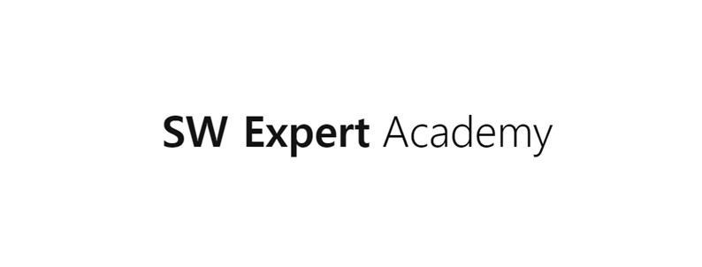
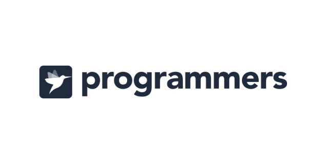

# Algorithm Study for SSAFY

## 개인용 알고리즘 스터디 라이브러리 📜

---

### 언어 관련 규칙

가능하다면 **JAVA를 우선적**으로 사용하여 알고리즘을 작성한다. (익숙해지기 위함)

- 주로 사용할 언어 : **JAVA (JDK 1.8)**
- 사용 가능한 언어 : **Python3**

### 나와의 규칙

1. 하루에 한 문제 이상 업로드 하기
2. 문제 풀이 후 백준 허브 사용하기

---

### 온라인 저지 사이트

- ********************************Baekjoon Online Judge(BOJ) →******************************** [https://www.acmicpc.net/](https://www.acmicpc.net/)

- **SW Expert Academy(SWEA)** → [https://swexpertacademy.com/](https://swexpertacademy.com/)

- **Programmers** → [https://programmers.co.kr/](https://programmers.co.kr/)

### 기타 사이트

- 에듀싸피 → [https://edu.ssafy.com/](https://edu.ssafy.com/)
- 백준 허브 → [https://github.com/BaekjoonHub/BaekjoonHub](https://github.com/BaekjoonHub/BaekjoonHub)

---

### 작성일자

2023.08.01.